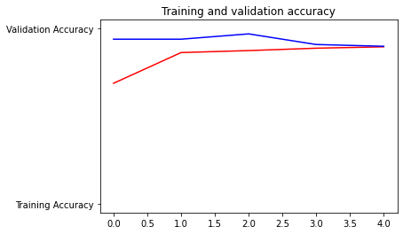
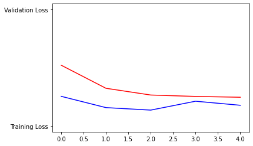

# Pizza-Identifier
Used CNN to identify images containing pizza with over 90% accuracy

## Overview

The code for Pizza_CNN_4_Layers.ipynb is based upon the [code](https://colab.research.google.com/github/lmoroney/dlaicourse/blob/master/Course%202%20-%20Part%204%20-%20Lesson%202%20-%20Notebook%20(Cats%20v%20Dogs%20Augmentation).ipynb) from Laurence Maroney from TensorFlow. The code for Pizza_CNN_Transfer_Learning.ipynb is based upon the code provided in a TensorFlow [tutorial on transfer learning](https://colab.research.google.com/github/keras-team/keras-io/blob/master/guides/ipynb/transfer_learning.ipynb#scrollTo=oJBFccp1gBp4).

## Results

After transfer learning, model obtained 89% test accuracy. After employing fine-tuning the model obtained 93% test accuracy. 

