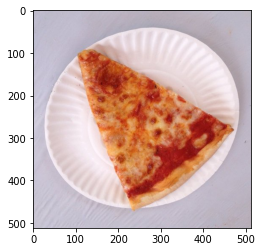
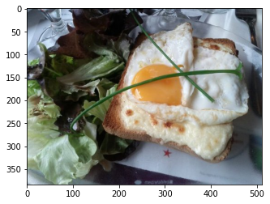
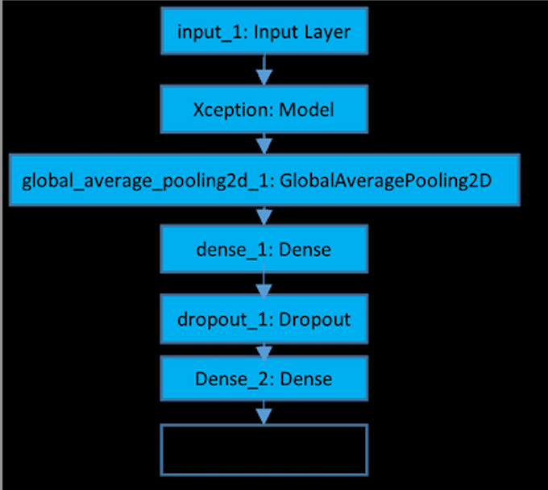
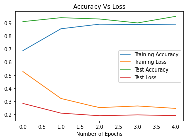

# Pizza-Identifier
Used CNN to identify images containing pizza with 95% test accuracy

## Overview

This project predicts whether an image of food shows pizza or a food other than pizza. Below are some sample images. Note that the food is not always centered, and there is typically a plain background, such as a white tablecloth. Since the dataset was relatively small for a CNN, transfer learning was applied along with image augmentation.

The code for Pizza_CNN_4_Layers.ipynb is based upon the [code](https://colab.research.google.com/github/lmoroney/dlaicourse/blob/master/Course%202%20-%20Part%204%20-%20Lesson%202%20-%20Notebook%20(Cats%20v%20Dogs%20Augmentation).ipynb) from Laurence Maroney from TensorFlow. The code for Pizza_CNN_Transfer_Learning.ipynb is based upon the code provided in a TensorFlow [tutorial on transfer learning](https://colab.research.google.com/github/keras-team/keras-io/blob/master/guides/ipynb/transfer_learning.ipynb#scrollTo=oJBFccp1gBp4).

## Architecture

The neural network has the arhcitecture seen in the following image. The input layer is the augmented images, which is fed into the Xception model. The weights of the base model remain fixed since the aim is to use what the model has already learned. Then, global average pooling replaces the top layer of the model. Adam was used as the optimizer and early stopping was employed to prevent overfitting. 

Image Source:

Koirala, Anand & Walsh, Kerry & Wang, Zhenglin. (2021). Attempting to Estimate the Unseen – Correction for Occluded Fruit in Tree Fruit Load Estimation by Machine Vision With Deep Learning. 10.20944/preprints202101.0534.v1. 

## Results

After transfer learning, model obtained 89% training accuracy and 95% test accuracy. After employing fine-tuning the model obtained 93% training accuracy and 95% test accuracy as before. 

